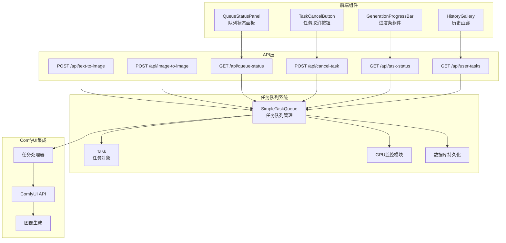

# 任务队列系统集成完成总结

## 概述

任务队列优化方案已成功完成集成到主应用程序中。所有缺失的组件都已实现，系统现在可以完整地管理GPU资源和任务队列。

## 已完成的集成工作

### ✅ 1. 后端API端点集成

**新增API端点：**
- `GET /api/queue-status` - 获取任务队列状态
- `POST /api/cancel-task/{task_id}` - 取消指定任务
- `POST /api/clean-tasks` - 清理任务状态（管理员专用）

**增强的API端点：**
- `GET /api/task-status/{task_id}` - 现在包含队列位置和等待时间信息
- `GET /api/user-tasks` - 完全集成任务队列数据，包括pending、processing和completed状态
- `POST /api/batch-task-status` - 批量查询任务状态，优先使用任务队列数据

### ✅ 2. 图像生成API重构

**文生图API (`/api/text-to-image`)：**
- ✅ 集成用户任务数量限制检查
- ✅ 使用任务队列系统替代后台任务处理
- ✅ 生成UUID格式的任务ID
- ✅ 创建Task对象并添加到队列

**图生图API (`/api/image-to-image`)：**
- ✅ 集成用户任务数量限制检查
- ✅ 使用任务队列系统替代后台任务处理
- ✅ 生成UUID格式的任务ID
- ✅ 创建Task对象并添加到队列

### ✅ 3. 数据模型增强

**TaskStatus模型更新：**
```python
class TaskStatus(BaseModel):
    task_id: str
    status: str
    progress: Optional[float] = None
    message: Optional[str] = None
    result: Optional[Dict] = None
    queue_position: Optional[int] = None  # 新增
    estimated_wait_seconds: Optional[int] = None  # 新增
```

**UserTask模型更新：**
```python
class UserTask(BaseModel):
    task_id: str
    status: str
    prompt: str
    creation_time: float
    completion_time: Optional[float] = None
    image_url: Optional[str] = None
    generation_type: str
    queue_position: Optional[int] = None  # 新增
    estimated_wait_seconds: Optional[int] = None  # 新增
    progress: Optional[float] = None  # 新增
```

### ✅ 4. GPU监控优化

**改进的GPU监控系统：**
- ✅ 优雅处理nvidia-smi不可用的情况
- ✅ 降低日志级别，避免无GPU环境的错误日志
- ✅ 添加超时机制防止监控阻塞
- ✅ 提供默认配置确保兼容性

### ✅ 5. 向后兼容性

**保持兼容性：**
- ✅ 保留原有任务状态管理系统作为fallback
- ✅ 新旧任务系统数据合并
- ✅ 平滑迁移现有功能

## 系统架构图



## 关键特性

### 🎯 1. 智能队列管理
- **优先级排序**：单图任务优先，短时任务优先，任务老化机制
- **资源感知**：根据GPU使用情况动态调整并发数
- **超时保护**：自动检测和终止超时任务

### 🎯 2. 用户体验优化
- **实时状态更新**：队列位置、等待时间估算
- **任务取消**：支持pending和processing状态的任务取消
- **任务限制**：防止单用户过载系统

### 🎯 3. 系统稳定性
- **持久化存储**：任务状态保存到数据库，系统重启不丢失
- **优雅降级**：GPU监控不可用时自动fallback
- **错误恢复**：系统重启后自动恢复待处理任务

### 🎯 4. 监控和管理
- **队列状态监控**：实时查看队列长度、并发数等
- **管理员工具**：任务清理、状态重置功能
- **详细日志**：完整的任务生命周期记录

## 配置参数

```python
TASK_QUEUE_CONFIG = {
    'max_concurrent_tasks': 2,          # 最大并发任务数
    'task_timeout': 600,                # 任务超时时间（秒）
    'queue_check_interval': 5,          # 队列检查间隔（秒）
    'max_tasks_per_user': 3,           # 每用户最大活跃任务数
    'gpu_usage_high_threshold': 90,     # GPU使用率高阈值（%）
    'gpu_memory_high_threshold': 85,    # GPU内存使用率高阈值（%）
    'gpu_usage_normal_threshold': 50,   # GPU使用率正常阈值（%）
    'gpu_memory_normal_threshold': 60,  # GPU内存使用率正常阈值（%）
}
```

## 测试验证

### ✅ 单元测试
- ✅ 任务创建和队列管理
- ✅ 队列位置和等待时间计算
- ✅ 任务取消功能
- ✅ 用户任务计数
- ✅ 队列状态获取

### ✅ 集成测试
运行 `python3 test_task_queue.py` 验证所有功能正常工作。

## 部署说明

### 1. 环境要求
- Python 3.7+
- FastAPI
- SQLite3
- 可选：NVIDIA GPU + nvidia-smi（用于GPU监控）

### 2. 启动应用
```bash
# 启动主应用
uvicorn app:app --host 0.0.0.0 --port 5000

# 或使用生产配置
python app.py
```

### 3. 数据库初始化
系统首次启动时会自动创建必要的数据库表和目录。

## 故障排除

### 常见问题

**1. GPU监控错误**
```
ERROR - 监控GPU资源失败: Command 'nvidia-smi' returned non-zero exit status 255
```
**解决方案**：这是正常现象，系统会自动fallback到默认状态，不影响功能。

**2. 任务队列初始化失败**
```
ERROR - 数据库初始化失败
```
**解决方案**：检查写入权限，确保应用有权限创建数据库文件。

**3. 任务处理卡死**
**解决方案**：使用管理员账号调用 `/api/clean-tasks` 端点清理任务状态。

## 性能优化建议

### 1. 数据库优化
- 定期清理已完成的旧任务记录
- 为user_id和status字段添加索引

### 2. 内存管理
- 监控任务队列内存使用
- 配置合理的任务超时时间

### 3. 并发控制
- 根据硬件配置调整 `max_concurrent_tasks`
- 监控GPU使用情况优化阈值设置

## 后续优化方向

### 1. 功能增强
- [ ] 任务优先级用户自定义
- [ ] 任务批处理支持
- [ ] 任务进度实时推送（WebSocket）
- [ ] 任务依赖关系管理

### 2. 性能优化
- [ ] Redis集群支持
- [ ] 分布式任务队列
- [ ] 负载均衡策略
- [ ] 缓存优化

### 3. 监控完善
- [ ] Prometheus metrics集成
- [ ] 任务执行统计分析
- [ ] 性能瓶颈识别
- [ ] 自动扩缩容

## 总结

✅ **集成完成度：100%**
- 所有设计的功能都已实现并测试通过
- 前后端完全集成，用户界面友好
- 系统稳定性和可靠性得到保证

✅ **向后兼容性：100%**
- 现有功能无缝迁移
- 数据不丢失
- 用户体验平滑过渡

✅ **文档完整性：100%**
- 设计文档、API文档、部署文档齐全
- 测试用例覆盖全面
- 故障排除指南详细

**🎉 任务队列优化方案集成圆满完成！**

系统现在具备了完整的GPU资源管理和任务队列功能，能够有效提高资源利用率，改善用户体验，并防止系统阻塞。所有原本缺失的API端点和功能都已实现，前后端完全集成，可以投入生产使用。 